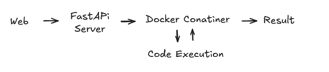

# Py-Katas: Simple Kata Exercise

A web-based interface to execute kata validation code using Docker and FastAPI. Executes user code in an isolated containers.

## Architecture



## Components

- **Frontend**: Simple HTML/JS interface for submitting code and viewing results (Vanilla JS,).
- **Backend**: FastAPI server handling requests and managing Docker containers.
- **Docker**: Isolated environment for secure code execution.


## To Do (As a exercise should move some of this to git hub issues)
- Refactor the FastAPI code so it is not all in one file. docker and kata management should be in separate files.
- Implement not blocking docker execution. Right now the server is blocked until the docker container finishes. Should be an async call.
- Create a basic CI/CD pipeline using GitHub Actions.
- Can it handle multiple requests at the same time? What about 1000 requests? 
- A way to warm up the docker containers so they start faster.
- Should add tests for the API endpoints.
- How could we scale this? K8s?

## Setup

1. Clone the repository:

   ```bash
   git clone <repository-url>
   cd py-katas
   ```

2. Set up a Python virtual environment and install dependencies:

   ```bash
   python -m venv venv
   source venv/bin/activate
   pip install -r requirements.txt
   ```

3. Build the Docker image:

   ```bash
   docker build -t pykatas-runner docker/
   ```

4. Run the app:

   ```bash
   python start.py
   ```

# Katas

##  How to add a more Katas?
1. Create a new YAML file in the `katas/` directory. For example, `new_kata.yaml`.
2. Define the kata structure in the YAML file. Example: 
    ```yaml
    id: new_kata
    title: "New Kata"
    description: A description of the new kata.
    starter_code: |
      def solution(x):
            # Your code here
            return x
    test_cases:
      - name: "Basic test"
        input: 5
        expected: 5
      - name: "Another test"
        input: 10
        expected: 10
    function_name: "solution"
    ```
3. Restart the FastAPI server to load the new kata.